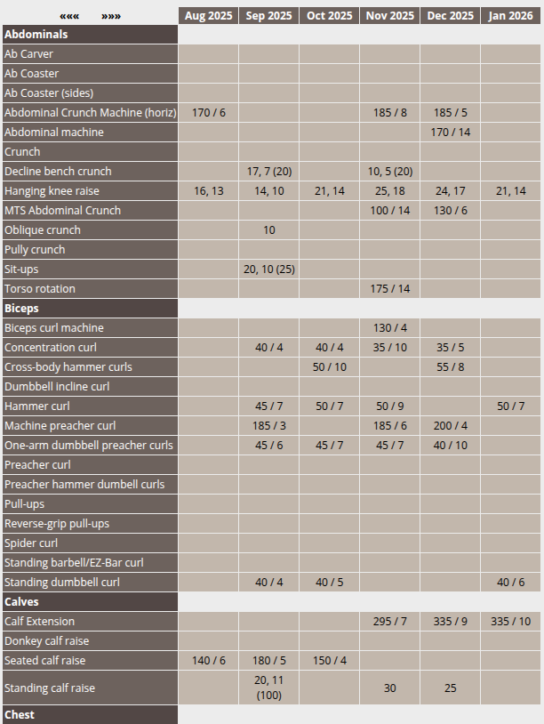
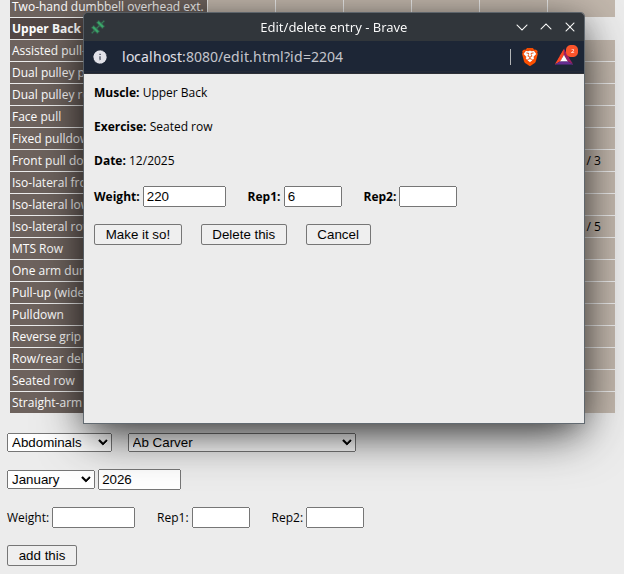

# Gym Workouts #

This project began as a means of tracking workout progress at the gym.
I created an HTML page, I would print it, take it to the gym with me,
and note my progress. I would then edit the HTML at a later time.
I eventually created a PHP application to be able to add, edit, and delete
entries.

I added a feature where I could "scroll" left and right to
reveal and hide different date ranges but display only 6 at a time.
The current design will detect if using a mobile device and only display 3
columns, but it will otherwise display 6. The original design had a major
flaw: it retrieved ALL the data at once, rendering all of them and
then hiding all but the last 6 via CSS:

### Python/Flask

I embarked on rewriting this in Python and Flask and to use AJAX to
retrieve only the columns that need to be displayed, and scrolling
left and right should retrieve one new column at a time. I became quite
disillusioned with Flask and, at the time, did not see a need to learn
Django, so ...

## Java/Spring

I created the Java/Spring version, and it worked (one bug outstanding):
https://bitbucket.org/drosario69/gym/src/main/

## Go

I needed to learn Go for specific reasons, and chose this project as a
way to learn Go. In terms of third-party libraries, it only uses the
PostGreSQL library. As of now, there is no ORM (considered learning
GORM), but as an initial release, this works.

I noticed how small the compiled Go binary is: 9.9MB, while the Java
version is 57MB+. The Go version also starts instantaneously rather than
having the Spring container discover repositories, instantiate beans, etc.
The UI looks exactly like the Java version:

The mobile-friendly features are pending; for example, I should not require
a popup for editing existing entries:

## Roadmap

- [ ] Asynchronous logging
- [x] Disable directory listing
- [ ] Mobile-friendly UI (in-place editing)
- [ ] Add tests
- [ ] Add CI/CD
- [ ] Deploy to Kubernetes using Helm
- [ ] Add user authentication
